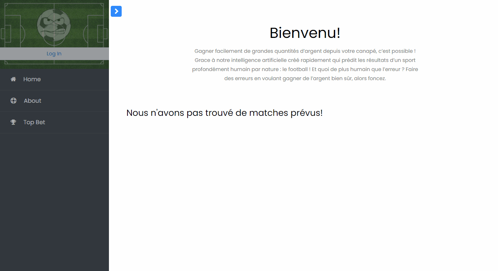

# FlaskFootPred

FlaskFootPred is a simple project originlly created to learn about flask framework.
The application is still under development. Fo now, only some pages are created as well as a login system. Users infos are stored in a sqlite database.

[Heroku app](https://flaskfootpred.herokuapp.com/)

### Main Keyworks:
Flask, jinja, Blueprint, FlaskLogin, SQLAlchemy

### Credits:
* [frontend template](https://colorlib.com/wp/template/bootstrap-sidebar-09/)
* [tech with tim tuto](https://www.techwithtim.net/tutorials/flask/a-basic-website/)
* [flasklogin tuto](https://www.digitalocean.com/community/tutorials/how-to-add-authentication-to-your-app-with-flask-login-fr)